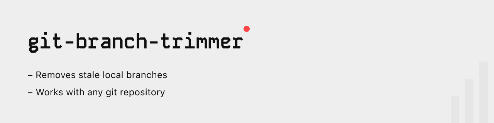

# Git Branch Trimmer



> A CLI tool to detect and remove stale **local** Git branches from your repository.

This tool analyzes your Git branches and helps you identify which ones can be safely deleted, based on whether they have remote counterparts and how long it's been since their last commit.

---

## 🛠️ Installation

Install globally using your preferred package manager:

```bash
# npm
npm install -g git-branch-trimmer

# pnpm
pnpm add -g git-branch-trimmer
```

---

## ⚙️ Requirements

- Node.js **16+**
- Git installed on your system

---

## 🚀 Usage

Run in any Git repository:

```bash
git-branch-trimmer
```

Optional flags:

```bash
# Custom stale threshold in days (default: 30)
git-branch-trimmer --stale-threshold 60

# Dry run mode
git-branch-trimmer --dry-run

# Skip confirmation prompt
git-branch-trimmer --force
```

**What it does:**

1. Scans all local branches
2. Identifies stale ones based on:
   - Missing remote counterpart
   - Last commit older than the threshold
3. Presents an interactive menu with:
   - Last commit date
   - Remote tracking info
4. Safely removes selected branches

---

## 📸 Screenshots

### 1. Branch Detection


### 2. Confirmation


### 3. Done!


---

## ✨ Features

- ✅ Detects stale branches based on:
  - No remote
  - Inactivity threshold (default: 30 days)
- 🧠 Smart, interactive selection
- 🎛️ Customizable CLI options
- 🧹 Safe deletion with confirmation
- 🎨 Clean, colored terminal output
- 🔧 Works with any Git repo

---

## 🧾 Command Line Options

| Option                         | Description                                                                 |
| ------------------------------ | --------------------------------------------------------------------------- |
| `-t, --stale-threshold <days>` | Set the threshold in days for a branch to be considered stale (default: 30) |
| `-d, --dry-run`                | Show what would be deleted without actually deleting                        |
| `-f, --force`                  | Skip confirmation prompt                                                    |

---

## 📄 License

[WTFPL](https://www.wtfpl.net/)
